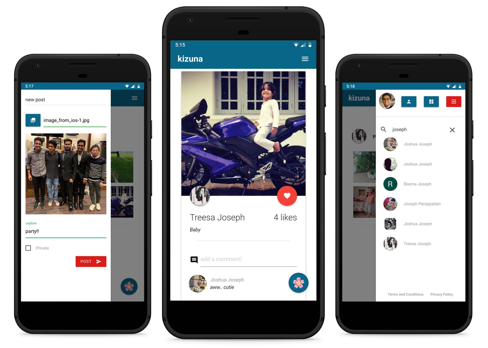

<h1 align="center">:cherry_blossom: kizuna</h1>
<h3 align="center">:large_blue_diamond: a photo sharing web app :large_blue_diamond:</h3>

<p align="center">

</p>

## Introduction
Welcome to kizuna, the photo sharing web app! This is my first venture into production level web app development, so please do spare me for any inconsistencies :sweat_smile:. The name kizuna was chosen as it means *bond* in Japanese. In-fact, it was kanji of the year 2011! :tada:

This is a simple web app. It allows users to sign-up via Google, Facebook or Twitter. Instagram support is also available, but has been temporarily disabled due to the lengthy app review requirements of Instagram.

Once the user signs-up, they are given the ability to-  
:heavy_check_mark: Create/Delete a public/private post  
:heavy_check_mark: Search for friends  
:heavy_check_mark: Follow/Unfollow friends  
:heavy_check_mark: Like/Unlike posts  
:heavy_check_mark: Comment on posts  

The app follows a minimal design philosophy, by maintaining the color scheme and the material design throughout. This is a responsive website, therefore making it suitable for viewing on a variety of screen sizes. It is best viewed on mobile screens, in a full-screen mode.

In terms of user experience, small enhancements like toast messages and lazy loading of images is also included.

## Project Structure
The project structure is as shown below:
```bash
.
├── public
│   ├── css
│   │   └── styles.css
│   ├── img
│   │   ├── android-chrome-192x192.png
│   │   ├── android-chrome-512x512.png
│   │   ├── apple-touch-icon.png
│   │   ├── favicon-16x16.png
│   │   ├── favicon-32x32.png
│   │   └── loading.gif
│   ├── js
│   │   ├── comments.js
│   │   ├── delete-post.js
│   │   ├── follow-unfollow.js
│   │   ├── lazy-load.js
│   │   ├── likes.js
│   │   ├── search.js
│   │   ├── ui.js
│   │   └── upload.js
│   └── manifest.json
├── samples
│   └── kizuna.png
├── src
│   ├── db
│   │   ├── aws.js
│   │   └── mongoose.js
│   ├── models
│   │   ├── comment.js
│   │   ├── follow.js
│   │   ├── like.js
│   │   ├── post.js
│   │   └── user.js
│   ├── passport
│   │   ├── facebook-strategy.js
│   │   ├── google-strategy.js
│   │   ├── instagram-strategy.js
│   │   ├── passport-setup.js
│   │   └── twitter-strategy.js
│   ├── routes
│   │   ├── auth.js
│   │   ├── post.js
│   │   ├── profile.js
│   │   ├── search.js
│   │   ├── upload.js
│   │   └── user.js
│   └── app.js
├── templates
│   ├── partials
│   │   ├── footer.ejs
│   │   ├── head.ejs
│   │   ├── header.ejs
│   │   ├── menu.ejs
│   │   ├── new-post.ejs
│   │   └── post-gallery.ejs
│   └── views
│       ├── feed.ejs
│       ├── login.ejs
│       ├── post.ejs
│       ├── privacy-policy.ejs
│       ├── profile.ejs
│       └── terms-conditions.ejs
├── .env
├── .gitignore
├── LICENSE
├── package.json
├── package-lock.json
└── README.md
```
All of the server side code is included in the `src` directory, while the client side code is in the `public` direcory. This project makes use of templating with EJS to minimize the amount of redundant code.

## Local Development
### Credential setup
This project makes use of the dotenv npm package for managing the environment variables. Prior to running the app locally, it is necessary to obtain the private credentials for the following:  

* [Google OAuth API](https://console.developers.google.com)
* [Facebook Developers](https://developers.facebook.com/)
* [Twitter Developers](https://developer.twitter.com)
* [Instagram Developers](https://www.instagram.com/developer/)
* [Amazon AWS](https://aws.amazon.com/)
* [MongoDB Atlas](https://www.mongodb.com/cloud/atlas)  

Once all the credentials have been obtained, fill them in the dummy `.env` file located in the root of the project.  

> **Never commit the private credentials to version control. In this project, the dummy `.env` file serves the purpose of viewing the key names of the variables**

### Running the local server
First, install all the required node modules by running the command:  
`npm install`  

Run the local development script:  
`npm run dev`  

The dev script uses [nodemon](https://www.npmjs.com/package/nodemon) to monitor the changes made to the js, ejs and css files and then reloads the server on file changes.  

> You may view the dependencies of the app [here](https://github.com/tackyunicorn/kizuna/network/dependencies)  

## Production Setup
The setup for production environments depends greatly on the cloud provider used. This project is hosted using [heroku hobby dynos](https://devcenter.heroku.com/articles/dyno-types) on a custom root-level domain name - [kizuna.ml](https://kizuna.ml), served by [cloudflare nameservers](https://support.cloudflare.com/hc/en-us/articles/205195708-Changing-your-domain-nameservers-to-Cloudflare). Since the primary purpose of the app is to interact with images, all forms of image upload and hosting is done via Amazon AWS [S3 Buckets.](https://aws.amazon.com/s3/) An M0 Sandbox [MongoDB Atlas](https://www.mongodb.com/cloud/atlas) cluster instance is used as the cloud database solution.

Most cloud providers provide the functionality for specifying the environment variables. Do lookup the documentation for your cloud provider for the detailed process.

## License
kizuna is licensed under the [MIT](LICENSE) license.